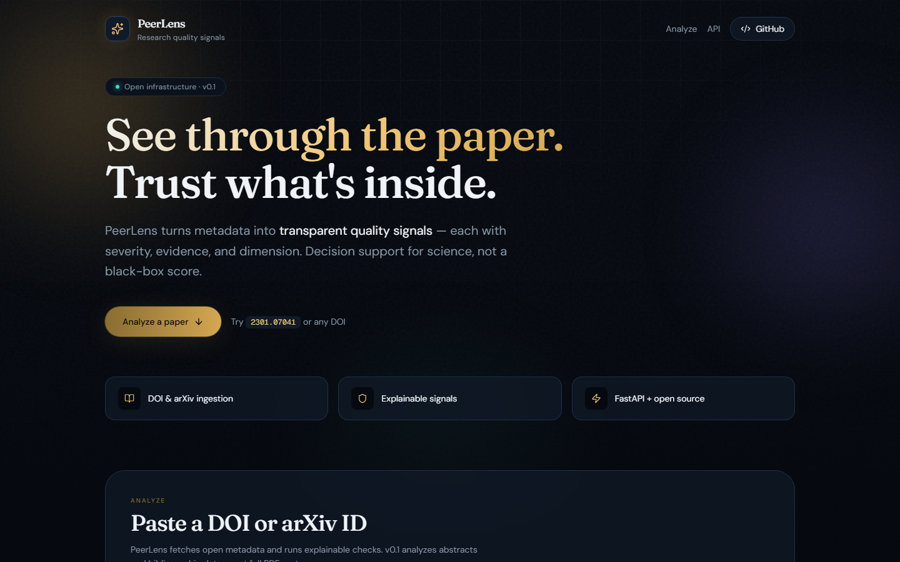
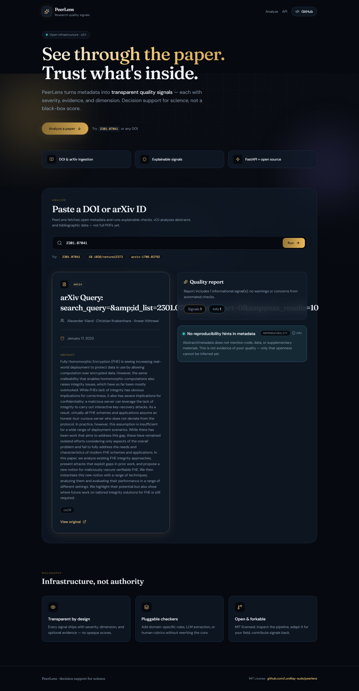

# PeerLens

**Open infrastructure for transparent research quality signals.**

PeerLens helps researchers, reviewers, and institutions assess papers with **explainable automated checks** — not a single opaque score. It fetches metadata from open sources (Crossref, arXiv), runs pluggable quality signal checkers, and returns a structured report you can inspect, extend, and fork.

> Decision support for science, not a proprietary credit rating.

## Preview






## What it does today (v0.2)

- Ingest papers by **DOI** or **arXiv ID** (URL formats supported)
- **Auto-fetch arXiv PDFs** and extract section headings (methods, results, etc.)
- **Upload PDFs** for full-text artifact and section analysis
- Run automated **quality signals**: metadata completeness, **Crossref retraction checks**, **code/data artifact links**
- Expose a **FastAPI** service, **CLI**, and **web UI**

## Quick start

### Requirements

- Python 3.11+
- pip (or [uv](https://github.com/astral-sh/uv))

### Install

```bash
git clone https://github.com/LordKay-sudo/peerlens.git
cd peerlens
python -m venv .venv

# Windows
.venv\Scripts\activate

# macOS / Linux
source .venv/bin/activate

pip install -e ".[dev]"
cp .env.example .env
```

### Run the API

```bash
peerlens serve --reload
```

Open [http://localhost:8000/docs](http://localhost:8000/docs) for interactive API docs.

### Run the web UI

In a second terminal:

```bash
cd web
npm install
npm run dev
```

Open [http://localhost:3000](http://localhost:3000). The frontend proxies `/api/*` to the FastAPI backend on port 8000.

### Analyze a paper (CLI)

```bash
peerlens analyze 10.1038/nature12373
peerlens analyze 2301.07041
```

### Analyze a paper (HTTP)

```bash
curl -X POST http://localhost:8000/api/v1/papers/analyze \
  -H "Content-Type: application/json" \
  -d '{"identifier": "2301.07041"}'
```

## Architecture

```
peerlens/
├── src/peerlens/     # FastAPI backend
│   ├── api/              # FastAPI routes
│   ├── services/
│   │   ├── ingestion/    # DOI (Crossref), arXiv metadata fetchers
│   │   ├── signals/      # Pluggable quality checkers
│   │   └── reports.py    # Orchestrates ingest → signals → report
│   └── models/           # Pydantic schemas
└── web/              # Next.js frontend (React, Tailwind, Framer Motion)
```

**Signal checkers** implement a small interface (`SignalChecker`) and return structured `QualitySignal` objects — each with an ID, severity (`info` / `warning` / `concern`), message, and optional evidence span.

## Roadmap

- [ ] PDF ingestion and section-aware extraction
- [ ] RAG over paper + references
- [ ] LLM-assisted claim / method extraction (opt-in, traced)
- [ ] Human review rubric API (blinded expert scores)
- [ ] Evaluation harness on known retractions / replication failures
- [ ] Plugins for Zotero, OpenReview, institutional repos

## Limitations

PeerLens v0.1 analyzes **metadata only** (title, abstract, authors, dates). Absence of a warning is not endorsement. Automated signals are heuristics — always pair with expert judgment for high-stakes decisions.

## Contributing

Issues and PRs welcome. See [GitHub Issues](https://github.com/LordKay-sudo/peerlens/issues) for planned work.

## License

MIT — see [LICENSE](LICENSE).

## Author

Built by [LordKay](https://github.com/LordKay-sudo).
